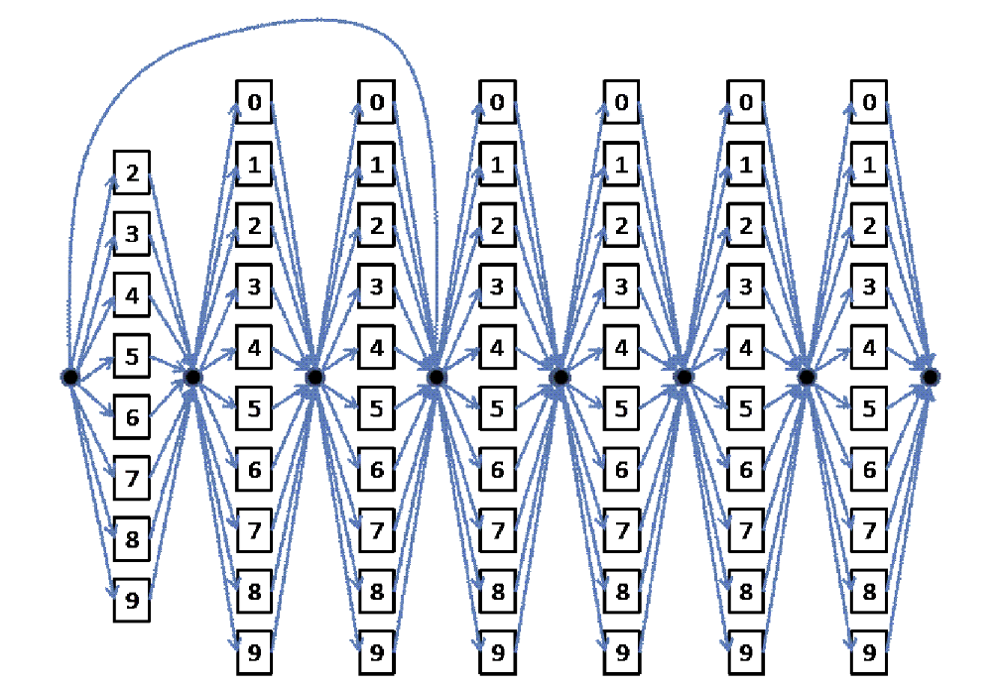
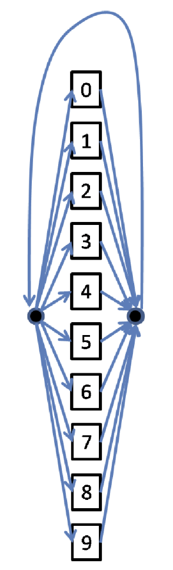

# Speech Recognition with Manual Implementations

## Overview
This project implements a continuous speech recognition system using Hidden Markov Models (HMMs) to recognize digit sequences. The system can handle both telephone number recognition and unrestricted digit string recognition.

## Project Structure
```
recognition
├── README.md
├── Recording.py          # Handles audio recording functionality
├── SGMM.py              # Implements Segmental Gaussian Mixture Models
├── fixed_hmm_con.py     # Fixed-structure HMM for continuous recognition
├── hmm.py               # Core HMM implementation
├── loopback_hmm_con.py  # HMM with loopback for unrestricted sequences
├── main.py              # Main execution script
├── mfcc_s.py           # MFCC feature extraction
├── segk.py             # Segmental K-means implementation
├── sgmm_p2.py          # Additional SGMM processing
├── utils.py            # Utility functions
└── tree_visualization.png # Visualization of HMM structure
```

## Features
1. **Digit Recording and Training**
   - Records individual digits (0-9)
   - Supports continuous recording of digit sequences
   - Generates 30 recordings per digit for robust training

2. **Phone Number Recognition**
   - Recognizes 7-digit and 4-digit telephone numbers
   - Implements constraints for valid phone numbers (first digit never 0 or 1)
   - Uses concatenated HMM models with silence models

3. **Unrestricted Digit Recognition**
   - Supports recognition of arbitrary-length digit sequences
   - Implements insertion penalty to prevent random digit hypotheses
   - Optimized for recognition accuracy

## Setup and Usage

### Prerequisites
- Python 3.8.0
- Required Python packages:
  - numpy
  - scipy
  - sounddevice
  - librosa


### Data Collection
1. Run the recording script:
```bash
python Recording.py
```
2. Record each digit sequence as specified in the assignment:
   - Record "0" through "9" five times each
   - Record sequences without pauses between digits
   - Total of 30 recordings per digit

### Training
1. Initialize HMMs using isolated recordings
2. Train silence models using 5 separate 1-second silence segments
3. Concatenate models for continuous recognition

```python
# Example training code
python main.py
```

### Recognition
The system supports two recognition modes:

<!-- <div style="display: flex; justify-content: center; align-items: start; gap: 20px;">
    <div>
        
        <p><em>Figure 1: Phone Number Recognition</em></p>
    </div>
    <div>
        
        <p><em>Figure 2: Unrestricted Digit Recognition</em></p>
    </div>
</div> -->
<div style="display: flex; justify-content: center; align-items: center; gap: 20px;">
    <div style="text-align: center">
        
        <p><em>Mode 1: Phone Number Recognition</em></p>
    </div>
    <div style="text-align: center">
        
        <p><em>Mode 2: Unrestricted Digit Recognition</em></p>
    </div>
</div>

The system can perform the following functions...
[Your subsequent content here]

1. **Phone Number Recognition**
```python
python main.py --mode phone --input <audio_file>
```

2. **Unrestricted Digit Recognition**
```python
python main.py --mode unrestricted --input <audio_file>
```

## Implementation Details

### HMM Structure
1. **Phone Number Recognition**
   - Concatenated HMM structure with 7 or 4 digit positions
   - Each position contains models for valid digits
   - Non-emitting states between digits for transition modeling

2. **Unrestricted Recognition**
   - Loopback structure allowing arbitrary-length sequences
   - Insertion penalty to control hypothesis generation
   - Optimized for recognition accuracy

### Feature Extraction
- MFCC features extracted from audio input
- Segmental K-means for initial state alignment
- GMM-based acoustic modeling

### Model Training
1. Initialize models using isolated recordings
2. Train silence models separately
3. Combine models using concatenation rules
4. Optimize parameters using continuous recordings

## Performance Optimization

### Phone Number Recognition
- Constrained first digit (no 0 or 1)
- Fixed-length sequence modeling
- Silence model integration

### Unrestricted Recognition
- Empirically determined insertion penalty
- Loopback transition modeling
- Recognition error minimization

## Acknowledgments
- This repository is based on COMPSCI304 Spring 2024 Course Project.
